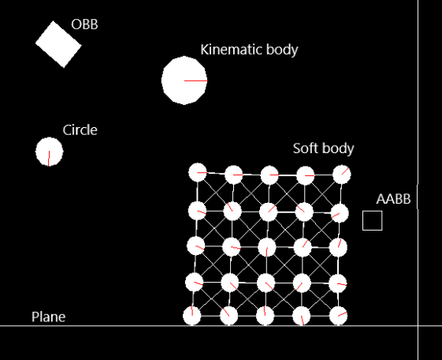

# 2D Physics Engine
The application I have created is a working 2D C++ physics engine that can be implemented
into a proper game engine. No third-party physics engine was used to aid the project.
It demonstrates a complex simulation containing multiple static and dynamic rigid bodies
interacting together, as well as additional bodies such as joints, springs and soft bodies. All
bodies are able to be added or removed from the simulation dynamically.
The engine includes four body shapes: circle, plane, axis-aligned bounding box (AABB), and
oriented bounding box (OBB). Collision detection is performed using the spatial hashing
method. The various body shapes are able to resolve collisions using linear forces and
angular forces.

[LINK](https://github.com/DavidF-Dev/Physics2D-2020/raw/master/Physics2D%20Application.exe) Download the release to try out the application. 
[LINK](https://github.com/DavidF-Dev/Physics2D-2020/blob/master/Documentation.pdf) Documentation outlining improvements that could be made. 
[LINK](https://github.com/DavidF-Dev/Physics2D-2020/blob/master/UML%20Class%20Diagram.svg) Complete UML class diagram that shows relationships and includes all classes. 

  
 
Academy of Interactive Entertainment Canberra 
Bachelor of Games and Virtual Worlds
